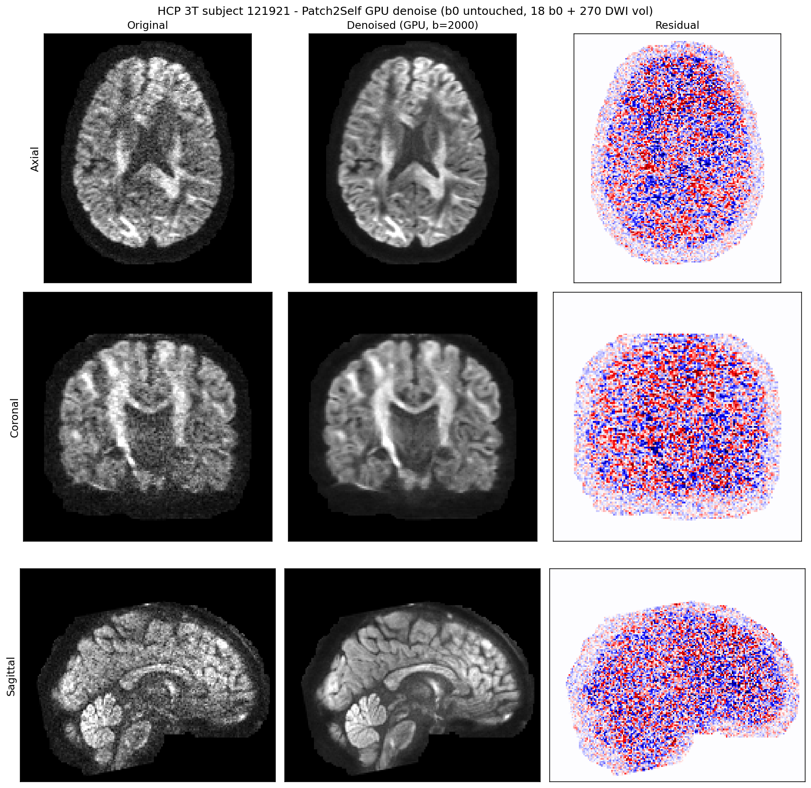
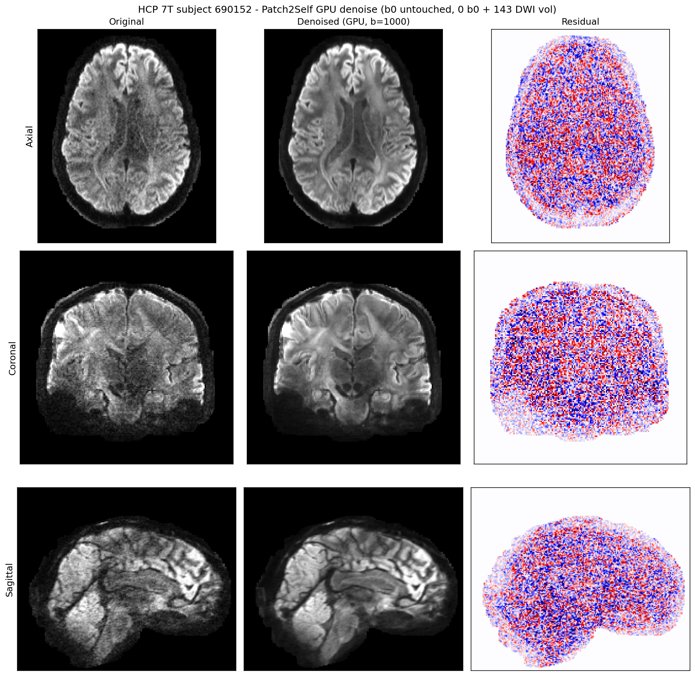

# Patch2Self-GPU

**GPU-accelerated Patch2Self denoising for high angular resolution diffusion MRI.**

A PyTorch re-implementation of [DIPY](https://dipy.org)'s
[Patch2Self](https://docs.dipy.org/stable/examples_built/preprocessing/denoise_patch2self.html)
denoiser, written with the permission and reference of the original work. It
solves exactly the same leave-one-out ordinary least squares problem as
`dipy.denoise.patch2self`, but on the GPU in float64 over all voxels —
turning a multi-hour CPU job into a ~10 minute GPU job per case.

---

## Results

HCP-YA subjects, original vs. denoised vs. residual (axial / coronal /
sagittal centre slices). b0 volumes are untouched; the residual shows the
noise removed from the DWI shells.

**3T subject 121921** — 288 volumes (18 b0 + 270 DWI, 145×174×145 voxels):



**7T subject 690152** — 143 DWI volumes:



---

## Why another Patch2Self?

The reference implementation in DIPY is CPU-only (scikit-learn backend). On
HCP-YA 3T data a single 288-volume case costs ~28.5 s **per DWI volume** —
roughly **1.5–2 hours** of CPU time. DIPY's default (v3) path mitigates this
by *sub-sampling* the voxels with a count sketch (30% of rows) and solving in
float32.

This project takes the opposite direction: keep the problem exact and move it
to the GPU.

|                          | DIPY `patch2self` (v3, default)        | Patch2Self-GPU                        |
| ------------------------ | -------------------------------------- | ------------------------------------- |
| Backend                  | scikit-learn, CPU                      | PyTorch, CUDA (CPU fallback included) |
| Voxels used per fit      | 30% count-sketch sub-sample            | **all** voxels                        |
| Precision                | input dtype (usually float32)          | **float64**                           |
| Time per 3T case (270 DWI) | ~1.5–2 h (many-core CPU)             | **~10 min** (one RTX 4090)            |
| b0 handling              | denoised by default                    | **untouched** by default              |
| Intensity shift          | documented but a no-op in 1.10 (see below) | implemented as intended            |

### The float32 trap

For a typical HCP 3T design matrix (3.66M voxels × 270 volumes), **262 of the
269 singular values fall below float32's `rcond` threshold**. A float32 solve
— on GPU *or* CPU — therefore loses about **15% relative accuracy** versus the
float64 truth. This is not a GPU bug: DIPY's own float32 output differs from
its float64 output by the same margin. Patch2Self-GPU always solves in
float64, which costs 2× memory but removes the error entirely.

Measured agreement on a full HCP 3T case (see `tests/`):

```
GPU float64  vs  sklearn float64 (full scale):  max|diff| = 0.000000
                                               rel.max  = 9.8e-14
                                               corr     = 1.0000000000
```

### The intensity-shift no-op

DIPY 1.10 documents `shift_intensity` as giving non-negative values, but its
implementation computes

```python
shift = np.min(denoised_arr[..., i]) - np.min(denoised_arr[..., i])   # == 0
```

which does nothing. Patch2Self-GPU implements the intended behaviour — shift
each denoised volume so its minimum matches the corresponding noisy volume's
minimum (`den + (noisy.min() - den.min())`), which is also what the original
Patch2Self reference code does. Pass `shift_intensity=False` to disable.

---

## Installation

```bash
git clone https://github.com/slrl123/Patch2Self-GPU patch2self_GPU
cd patch2self_GPU
pip install -r requirements.txt
```

Requires PyTorch >= 2.0 with CUDA for GPU use (any CUDA device works; the
design matrix is float64 so **~10 GB of VRAM** is recommended for full HCP
cases). Falls back to CPU automatically when no GPU is present.

---

## Usage

### Library

```python
import numpy as np
from patch2self_gpu import patch2self_gpu

# data: (X, Y, Z, N) float32/float64, bvals: (N,)
denoised = patch2self_gpu(data, bvals)

# denoise the b0 volumes too (DIPY's default behaviour)
denoised = patch2self_gpu(data, bvals, b0_denoising=True)

# pick a specific card
denoised = patch2self_gpu(data, bvals, device="cuda:1")
```

### Single case

```bash
python scripts/denoise_single_case.py \
    /HCP-YA/3T/Diffusion_Preprocessed/121921/T1w/Diffusion/data.nii.gz \
    --bvals /HCP-YA/3T/Diffusion_Preprocessed/121921/T1w/Diffusion/bvals \
    --visualize
```

Writes `<data>_denoised.nii.gz` (use `-o` to choose another path), reports
b0/DWI counts, timing, peak memory, and — with `--visualize` — a 3-view
comparison PNG. `--bvals` can be omitted when a `bvals` file sits next to the
image, which is the convention for most processed dMRI datasets.

### HCP-YA batch

```bash
python scripts/denoise_hcp_batch.py \
    --src-root /path/to/HCP-YA \
    --out-root /data/HCP-denoise \
    --gpus 2,3 \
    --cases-3t 250 --cases-7t 50
```

* Preserves the original HCP tree under `--out-root`, copying `bvals`,
  `bvecs`, `nodif_brain_mask.nii.gz` and the T1w image alongside the denoised
  `data.nii.gz` — existing pipelines need only change their data root.
* Case selection is a deterministic seeded permutation (`--split-seed`) per
  field strength, so re-runs select the same subjects.
* One worker subprocess per GPU, pinned via `CUDA_VISIBLE_DEVICES` before any
  CUDA initialisation. Processes are named `dayong-denoise` / `dayong-denoise-gpuN`.
* Already-denoised cases are skipped; pass `--force` to redo them. Per-case
  timing is printed and logged to `<out_root>/denoise_stats.jsonl`.

### Tests

```bash
python -m pytest tests/ -v
```

The suite runs on CPU only (it empties `CUDA_VISIBLE_DEVICES` on import, so
it never competes with running GPU work) and compares the output against a
direct float64 `sklearn.linear_model.LinearRegression` leave-one-out fit —
the same solver DIPY's Patch2Self uses internally. Agreement is ~1e-14
relative.

We deliberately do **not** assert equality against DIPY's own `patch2self`
output: DIPY solves in the input dtype (float32 for most real data), and on
near-collinear shells its float32 path can differ from the float64 truth by
~15% relative (see "The float32 trap" above), so such a test would be checking
the wrong thing.

---

## How it works

Patch2Self is self-supervised: each DWI volume is denoised by predicting it
from the *other* volumes of the same acquisition, at the same voxel. With
DIPY's default `patch_radius=(0, 0, 0)` the model for volume $v$ of a group
$G$ is

$$
\hat{x}_v \;=\; \beta_0 \;+\; \sum_{u \in G \setminus \{v\}} \beta_u \, x_u,
\qquad \beta = \arg\min_\beta \| X_{-v} \beta - x_v \|^2
$$

where $X_{-v}$ stacks all voxels of the *other* volumes in the group. This is
ordinary least squares with an intercept, which DIPY solves with
`sklearn.linear_model.LinearRegression(fit_intercept=True)` on the CPU.

Patch2Self-GPU solves the identical problem with one GPU call per volume:

1. Build the train matrix `train` of shape `(n_volumes, n_voxels)`, upload
   once as a float64 `(n_voxels, n_volumes)` tensor.
2. For each volume $v$: replace column $v$ with a column of ones (the
   intercept), call `torch.linalg.lstsq(X, y, driver="gels")`, predict
   `X @ sol`, then restore the original column in place.

The intercept-column swap makes the solve exactly equivalent to
`fit_intercept=True` while keeping peak memory at ~2× the design matrix, and
the in-place column restore avoids re-uploading the data. DIPY's group
structure is preserved as well: **DWI volumes are regressed against DWI
volumes only** — b0 volumes never enter the DWI design matrix (their
coefficient is fixed at 0), and b0 volumes, if denoised at all, are regressed
against the other b0 volumes.

The `'gels'` driver is the only least-squares routine LAPACK ships for CUDA
(no `gelsd`/`gelsy`); the CPU fallback uses `gelsd`.

---

## Benchmarks

Single RTX 4090, HCP-YA preprocessed data, float64, all voxels:

| Case                 | Volumes      | Voxels    | GPU time |
| -------------------- | ------------ | --------- | -------- |
| 3T subject 121921    | 270 DWI      | 3,658,350 | 593 s    |
| 7T subject 690152    | 143 DWI      | 6,195,303 | 312 s    |

Both figures include NIfTI I/O, host→device transfer, all least squares
solves and writing the result. The equivalent full-precision scikit-learn CPU
solve for the 3T case costs ~28.5 s per volume (~77 min total), i.e. a
**~13× speed-up per volume**.

A full 250-case 3T + 50-case 7T batch takes roughly **23 h on two RTX 4090s**
(~15 h on three).

---

## Repository layout

```
patch2self_GPU/
├── patch2self_gpu/
│   ├── __init__.py         public API: patch2self_gpu()
│   └── denoise.py          core solver
├── scripts/
│   ├── denoise_single_case.py   one 4D DWI image
│   └── denoise_hcp_batch.py     HCP-YA tree, multi-GPU
├── tests/
│   └── test_equivalence.py      vs sklearn float64 and vs DIPY
├── docs/                   result figures used in this README
├── requirements.txt
├── CITATION.bib
└── LICENSE
```

---

## Acknowledgements

This project is a GPU re-implementation **based on** the Patch2Self work by
Sudhanya Fadnavis, Yogesh Rathi, Carl-Fredrik Westin and colleagues, and on
the reference implementation maintained in
[DIPY](https://dipy.org)
(`dipy.denoise.patch2self`,
[docs](https://docs.dipy.org/stable/examples_built/preprocessing/denoise_patch2self.html)).
We are grateful to the authors for publishing both the method and its code;
please cite their papers alongside this repository if you use it.

Tested against DIPY 1.10 / PyTorch 2.3 on NVIDIA RTX 4090.

## Citation

If this is useful, please cite:

```bibtex
@misc{patch2self_gpu,
  title        = {{Patch2Self-GPU}: GPU-accelerated Patch2Self denoising for
                  diffusion {MRI}},
  author       = {Su, Dayong},
  year         = {2026},
  howpublished = {\url{<repo-url>}},
  note         = {GPU re-implementation of DIPY's Patch2Self
                  \cite{fadnavis2020patch2self, fadnavis2024patch2self}}
}
```

See `CITATION.bib` for the full set of references.

## License

[BSD 3-Clause](LICENSE) — the same licence as DIPY.
